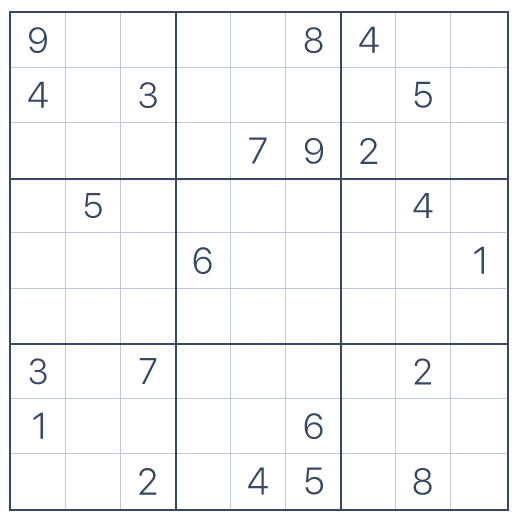
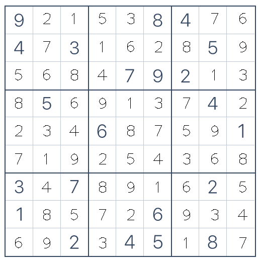
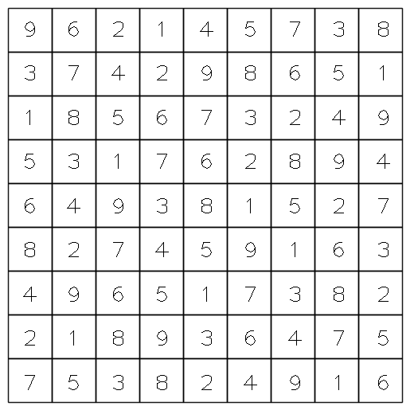
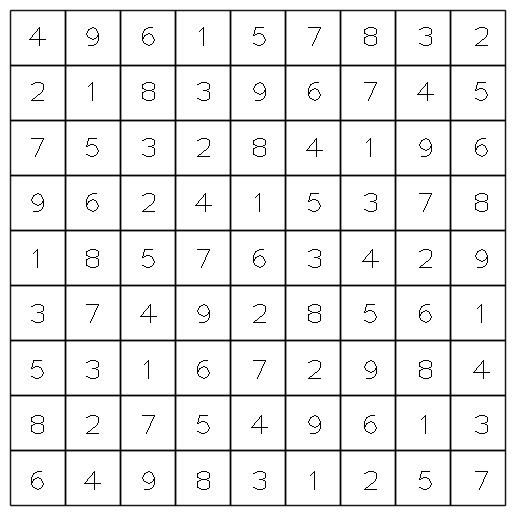

# Sudoku Solver

A blazing fast sudoku solver made in Go, supporting text and image input and output.

## Description

Provide an unsolved soduku (either in form of a screenshot, from a file or directly from the console) and have this program solve it and produce the output in many different formats!

## How to use

Before being able to run the script, either download the last release, clone the repo or build it from source. Then open the terminal and navigate to the folder containing the executable file.

- Load sudoku from a file called `sudoku-1.png` and save it into another image called `solved.png`: `sudoku-solver --imageinput sudoku-1.png --imageoutput solved.png`
- Load sudoku from console and print it in terminal: `sudoku-solver --stringinput --4-6--13-5-------6-3-----2-9---473--------8---2-1---94---------7---59----12----7 --stringoutput`
- Load sudoku from file called `sudoku-unsolvable.txt` and save it to a file called `sudoku-solved.txt`: `sudoku-solver --fileinput sudoku-unsolvable.txt --fileoutput sudoku-solved.txt`

Of course all the parameters can be mixed

- Load sudoku from a file called `sudoku-extreme.txt` and save it into an image called `that-was-easy.png`: `sudoku-solver --fileinput sudoku-extreme.txt --imageoutput that-was-easy.png`
- Load sudoku from an image called `another-sudoku.png` and print it into terminal: `sudoku-solver --imageinput another-sudoku.png --stringoutput`

## Commands

Complete list of commands:
| **Command** | **Description** | **Notes** |
|:-:|:-:|:-:|
| `-h --help` | Show help | |
| `--version` | Show current version | |
| `--fileinput` | Load sudoku from file | Line breaks are not necessary, use "-" or "0" as placeholder for empty cells |
| `--fileoutput` | Write solved sudoku in file | Will be written in a prettified way unless `--plaintext` flag is provided |
| `--imageinput` | Load sudoku from an image | |
| `--imageoutput` | Write solved sudoku over image |
| `--stringinput` | Load sudoku from terminal | Write all in one line, use "-" or "0" as placeholder for empty cells |
| `--stringoutput` | Print solved sudoku in terminal |
| `--plaintext` | Print solved sudoku in plaintext | Only valid if used with `--fileoutput` or `--stringoutput` flags |

## Requirements

In order to run this program from source (or compile it), you need to have installed:

- Gcc compiler
- Tesseract OCR

## Sample input and output

### Image

#### Sample input



[*courtesy of sudoku.com*](https://sudoku.com/)

#### Sample outputs

- Text output:

```plaintext
-------------
|921|538|476|
|473|162|859|
|568|479|213|
-------------
|856|913|742|
|234|687|591|
|719|254|368|
-------------
|347|891|625|
|185|726|934|
|692|345|187|
-------------
```

- Image output:



- File output: *(sample/solved-1.txt)*

`921538476473162859568479213856913742234687591719254368347891625185726934692345187`

### String

#### Sample input

String: `--------8---29-65-1---73----31-----4---38----82----1---9-5-7---2------7------49--`

#### Sample outputs

- Text output

```plaintext
-------------
|962|145|738|
|374|298|651|
|185|673|249|
-------------
|531|762|894|
|649|381|527|
|827|459|163|
-------------
|496|517|382|
|218|936|475|
|753|824|916|
-------------
```

- Image output:



- File output: *(sample/solved-2.txt)*

`962145738374298651185673249531762894649381527827459163496517382218936475753824916`

### File

#### Sample input

File *(sample/sudoku-3.txt)*

`-9---7----------457---8---6-----53---8------9--49---6-5-16---------4--1-------257`


#### Sample outputs

- Text output

```plaintext
-------------
|496|157|832|
|218|396|745|
|753|284|196|
-------------
|962|415|378|
|185|763|429|
|374|928|561|
-------------
|531|672|984|
|827|549|613|
|649|831|257|
-------------
```

- Image output:



- File output: *(sample/solved-3.txt)*

`496157832218396745753284196962415378185763429374928561531672984827549613649831257`

## License

This project is distributed under CC 4.0 License.
